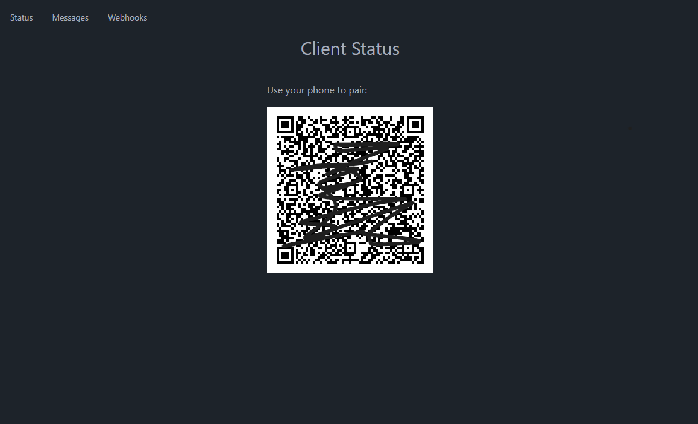
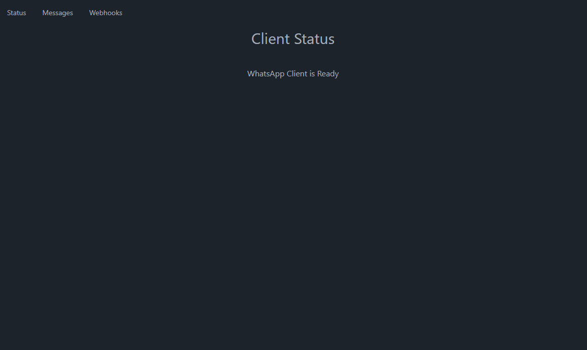
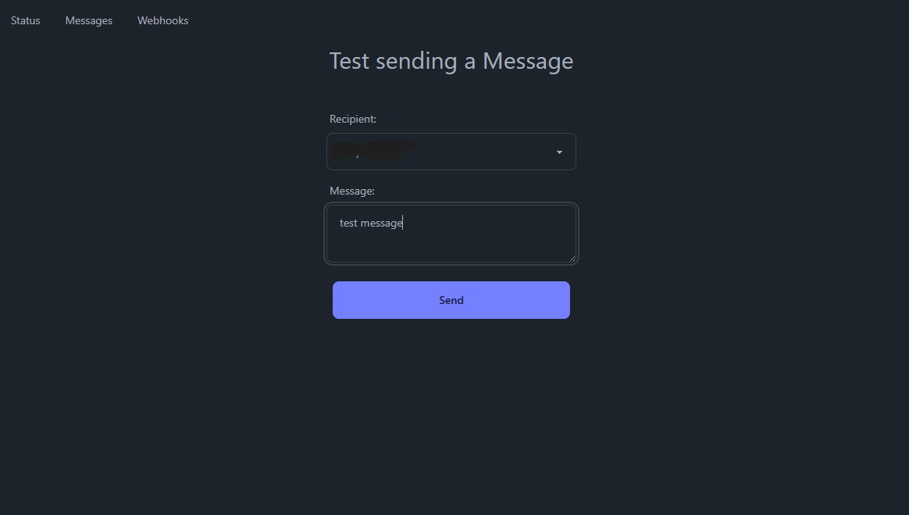
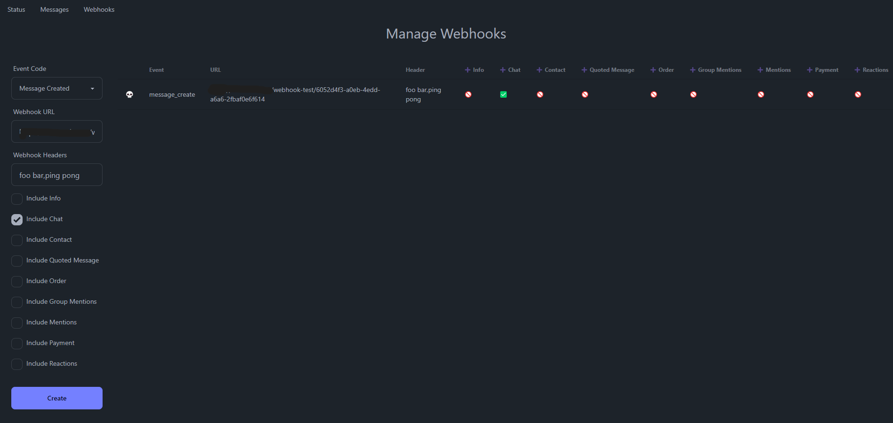

# WhatsApp Webhooks

Not meant to be a complete communication solution but a "setup and leave" integration between WhatsApp and other applications (like n8n.io) through webhooks and
REST APIs. Best suited for self-hosted environments and personal use.

> [!IMPORTANT]
> **Uses [whatsapp-web.js](https://github.com/pedroslopez/whatsapp-web.js), so it's not guaranteed you won't be blocked
by using this method. WhatsApp does
not allow bots or unofficial clients on their platform, so this shouldn't be considered totally safe.**

## 🚀 Features

- **WhatsApp Client**: Seamless UI connection to WhatsApp client
- **Real-time Status**: Monitor WhatsApp client connection status
- **Webhook Management**: Register and manage webhook callbacks for WhatsApp events
- **Message Handling**: Send and receive WhatsApp messages programmatically
- **Bot Integration**: API endpoints for bot implementation

## 📋 API Reference

### Contact Management

- `GET /api/contact/:id`
    - Returns contact information for a specific contact ID
    - Parameters: `id` (path parameter)

- `GET /api/contact`
    - Returns a list of all contacts

### Group Management

- `GET /api/groups`
    - Returns a list of all group chats

### Status

- `GET /api/status`
    - Returns the current status of the WhatsApp client
    - Response includes ready status and QR code (if not authenticated)

### Webhook Management

- `POST /api/webhook`
    - Creates a new webhook subscription
    - Required body parameters:
        - `event_code`: Type of event to subscribe to
        - `post_url`: URL where webhook notifications will be sent
    - Optional body parameters:
        - `auth_header`: Comma separated list of webhook request headers (Basic c2VjcmV0Cg==,Foo Bar)
        - `include_chat`: Include chat information (boolean)
        - `include_contact`: Include contact information (boolean)
        - `include_group_mentions`: Include group mentions (boolean)
        - `include_info`: Include additional info (boolean)
        - `include_mentions`: Include mentions (boolean)
        - `include_order`: Include order information (boolean)
        - `include_payment`: Include payment information (boolean)
        - `include_quoted_message`: Include quoted messages (boolean)
        - `include_reactions`: Include message reactions (boolean)

- `GET /api/webhook`
    - Returns a list of all registered webhooks

- `DELETE /api/webhook/:id`
    - Removes a webhook subscription
    - Parameters: `id` (path parameter)

### Messaging

- `POST /api/message`
    - Sends a WhatsApp message
    - Required body parameters:
        - `recipient`: Recipient's contact ID
        - `message`: Message content to send

**Authentication**

All API endpoints can optionally require the `x-api-key` header by setting the `WA_WEBHOOK_API_AUTH` environment
variable. When left bank authentication is disabled.

All endpoints return JSON responses and include appropriate error handling. Error responses will include a status code
and an error message in the following format:

```json
{
  "error": "Error message description"
}
```

Common HTTP status codes:

- 200: Successful operation
- 401: Invalid or missing x-api-key
- 400: Bad request (missing or invalid parameters)
- 500: Internal server error

## 🔧 Installation

- Copy .env.example to .env

- Run with node:

```bash
npm install
npm start
```

- Build and run with Docker:

```bash
docker compose -f compose.build.yaml up -d
```

- Run with Docker:

```bash
docker compose up -d
```

## 📊 User Interface

Divided into three sections:

* **Status**: View the current status of your WhatsApp client, including connection status and QR code (if not
  authenticated).

- QR waiting to be paired
  
- Client ready
  


* **Messaging**: Test sending WhatsApp messages to your contacts.
  


* **Webhooks**: Manage your webhook subscriptions, including creating, reading, and deleting webhooks.
  

## 🤝 Contributing

Contributions, issues, and feature requests are welcome!

## 📝 License

This project is licensed under the MIT License - see the [LICENSE](LICENSE) file for details.
